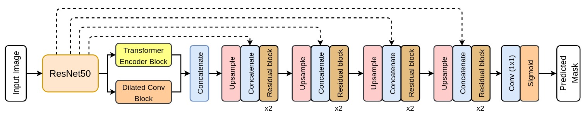
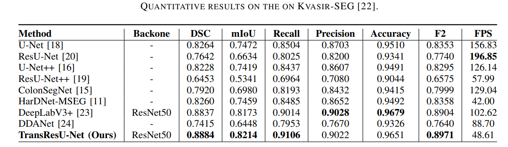
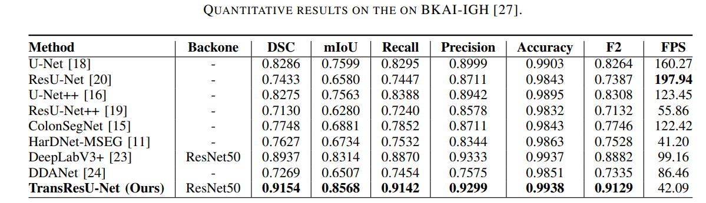
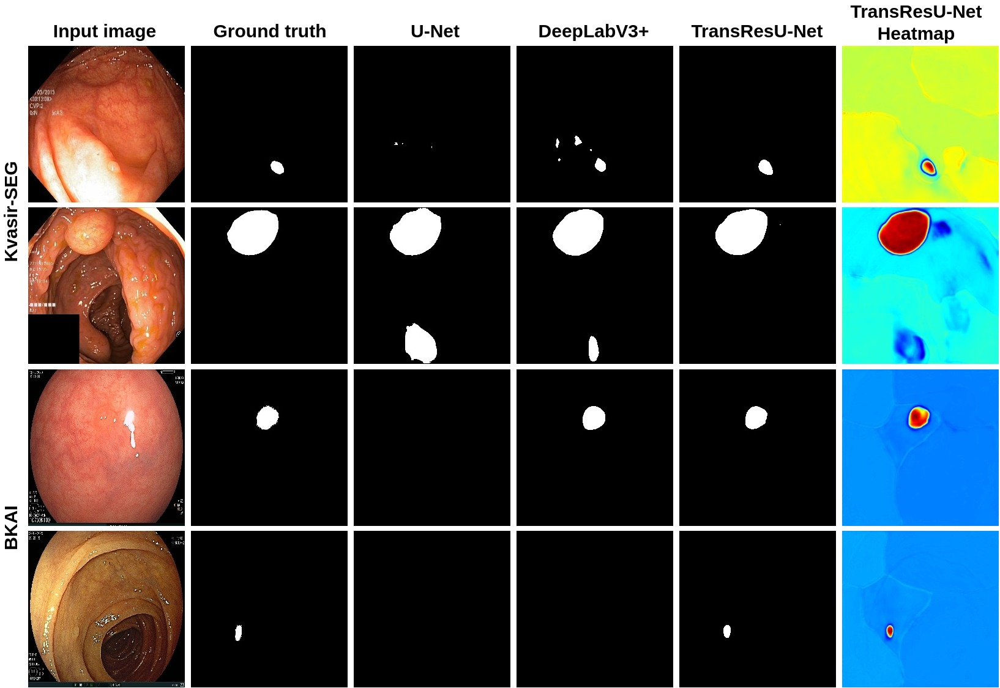

# TransResU-Net: Transformer based ResU-Net for Real-Time Colonoscopy Polyp Segmentation
Arxiv Link: [TransResU-Net: Transformer based ResU-Net for Real-Time Colonoscopy Polyp Segmentation](https://arxiv.org/pdf/2206.08985.pdf)

## 1. Abstract

Colorectal cancer is one of the most common causes of cancer and cancer-related mortality worldwide. Colonoscopy is the primary technique to diagnose colon cancer. However, the polyp miss rate is significantly high. Early detection of polyp at the precancerous stage can help reduce the mortality rate. Deep learning based computer-aided diagnosis system may help colonoscopists to identify neoplastic polyps and act as a second pair of eyes. Additionally, CADX system could be a cost-effective solution and might contribute to long-term colorectal cancer prevention. In this study, we proposed deep learning-based architecture, Transformer ResU-Net (TransResU-Net), for automatic polyp segmentation. TresResU-Net is an encoder-decoder based architecture built upon residual block and takes the advantage of transformer self-attention mechanism and dilated convolution. Experimental result on two publicly available polyp segmentation benchmark datasets shows that TransResU-Net obtained a promising dice coefficient and a real-time speed.

## 2. Architecture

## 3. Implementation
The proposed architecture is implemented using the PyTorch framework (1.9.0+cu111) with a single GeForce RTX 3090 GPU of 24 GB memory. 

### 3.1 Dataset
We have used the following datasets:
- [Kvasir-SEG](https://datasets.simula.no/downloads/kvasir-seg.zip)
- [BKAI](https://www.kaggle.com/competitions/bkai-igh-neopolyp/data)

BKAI dataset follows an 80:10:10 split for training, validation and testing, while the Kvasir-SEG follows an official split of 880/120.

### 3.2 Weight file
- [Kvasir-SEG](https://drive.google.com/file/d/1ekuDE3EmBVyU4uXf9r5HEnIO3Mzw5u7w/view?usp=sharing)
- [BKAI-IGH](https://drive.google.com/file/d/1pYvRa-KEcOSzR665Dkr9seXlaHT3rkyO/view?usp=sharing)

## 4. Results

### 4.1 Quantative Results

### 4.2 Qualitative Results

 Qualitative results comparison along with the heatmap 

## 5. Citation
<pre>
@article{tomar2022transresu,
  title={TransResU-Net: Transformer based ResU-Net for Real-Time Colonoscopy Polyp Segmentation},
  author={Tomar, Nikhil Kumar and Shergill, Annie and Rieders, Brandon and Bagci, Ulas and Jha, Debesh},
  journal={arXiv preprint arXiv:2206.08985},
  year={2022}
}
</pre>
## 6. License 
The source code is free for research and education use only. We allow comercial use, however a prior permission is required. 

## 7. Contact
Please contact nikhilroxtomar@gmail.com for any further questions. 
